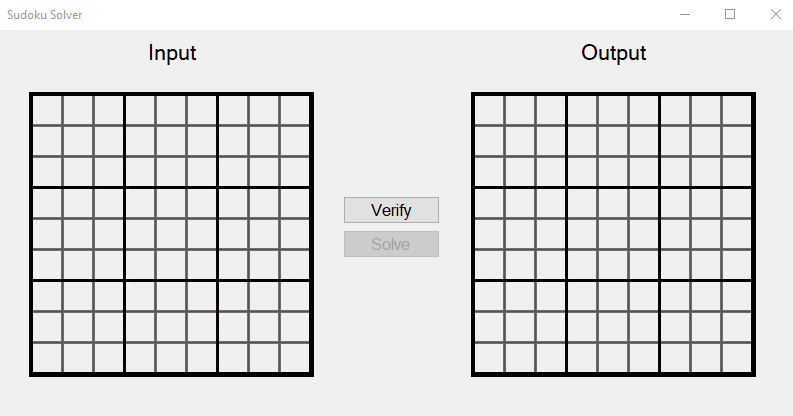
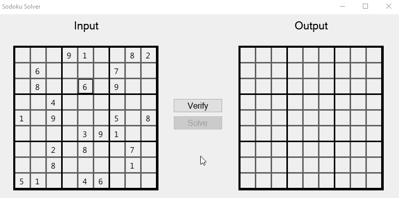

# SudokuSolver
Using Windows Forms, you can input the starting numbers on the left for the sudoku and see the result on the right side. Clicking on each cell to add/increase the number inside of it.

---

Once you've input your numbers, you must verify that it is a valid sudoku board before the application can solve it for you.  
*(That means no duplicate integers in a row, column, or 3x3 subgrid.)*

---

### After it is validated, you simply have to click the "Solve" button, and the solution will show up on the Output side.

